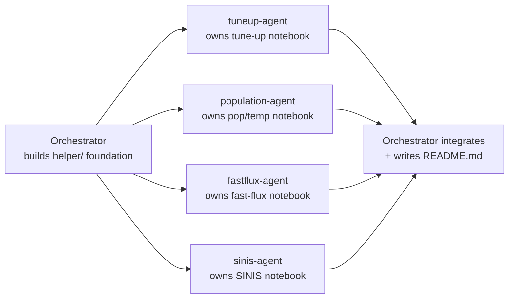

# Problem statement
All code today lives in one 625-cell notebook (`Workflow-v1.7.3.json`, ~9000 lines) that mixes: generic setup, 12 tune-up experiments (spectroscopy, control pulses, readout optimisation), single-shot/population/temperature measurements, fast-flux-drive experiments, and SINIS DC-calibration/heating-sweep experiments. It must be split into 4 standalone template notebooks, backed by a clean, reusable `qubit_thermometry` Python package (helpers + experiment/analysis workflows), modeled on `laboneq-applications/src/laboneq_applications` (`experiments/` + `analysis/`).
## Key constraint
Only `# Tune-up experiments` (cells 31-223: Spectroscopy, Control Pulses ge/ef, Readout Optimisation) builds the QPU from scratch and must save it + print a final summary (tuned parameters, what was tuned, save path). The other 3 notebooks load that saved QPU, connect to devices, and run their own measurements (some of them, e.g. single-shot/readout tuning, still update and re-save the same QPU file, matching current behaviour).
# Current-state findings (research already done)
* Notebook sections (by cell index): 0-30 common setup, 31-223 tune-up (`# Spectroscopy`, `# Control Pulses`, `# Readout Optimisation`), 224-284 `# Single Shot 0 and 1 Measurements`, 285-391 `# Population Measurements`, 392-462 `# Fast Flux Drive`, 463-624 `# SINIS Calibration...`.
* Most tune-up experiments (resonator/qubit spectroscopy, amplitude Rabi, T1, Ramsey, DRAG, echo, amplitude-fine error amplification, dispersive shift, IQ blobs) call **existing** `laboneq_applications`/`laboneq_applications.contrib` workflows directly - no custom experiment code needed. Two exceptions repeat the same manual loop twice (once for ge, once for ef) and should become one reusable function each:
    * "Rabi Chevron" (cells 63-71 / 139-147): sweep detuning, call `amplitude_rabi.experiment_workflow` per point, plot 2D map.
    * "Rabi Frequency Calibration" (cells 72-80 / 148-156): sweep drive length, call `amplitude_rabi.experiment_workflow` per point, linear-fit amplitude vs. 1/length.
    * "Dispersive Shift" analysis plots (cells 216-218) are custom (3-state spectroscopy/IQ/distance plots) and should become one analysis function.
* `laboneq_applications` has no population experiment: `population`, `rabi_population`, `quick_rabi_population` experiments/workflows are fully custom (`create_*_experiment` `@workflow.task` + `*_experiment_workflow` `@workflow.workflow`, cells 289-4177), following exactly the `laboneq_applications/experiments/*.py` pattern (see `laboneq-applications/src/laboneq_applications/experiments/amplitude_rabi.py`).
* Fitting/temperature helpers defined inline (cells 12-14, 291-297, 3298-3784) are explicitly comments as "New-structure replacement" for old `lib/helpers/{fitting_helper,pop_temp_helper_v2}.py` - these are the canonical new versions to migrate, not the old `lib/helpers/*` files.
* Temperature/fitting/plotting helpers (`get_ABC_parallel`, `get_temperature`, `plot_temp_single`, `auto_T1_fit`, `pop_label_list`, `collect_population_from_result`, etc., defined under "Population Measurements") are **reused by Fast Flux Drive and SINIS Calibration** sections too, so they must live in a shared location, not be duplicated per-notebook.
* Fast Flux Drive (cells 392-462) is pure LabOne Q flux-pulse control (no external hardware) with 3 custom experiment/workflow pairs (`flux_amplitude_calibration`, `fast_flux_decay`, `population_flux`) plus its own fit/plot helpers (`func_exp`, `fit_T1`, `auto_T1_fit`, `plot_2d`, etc.), and reuses `population_experiment_workflow`/temperature helpers from Population Measurements.
* SINIS Calibration (cells 463-624) connects real hardware (`lib/devices/KeysightDMM34465A`, `lib/devices/SIM_wrapper` (`SIM900`/`SIM928`), `blueftc.BlueforsController` via `lib/devices/bftc_credentials`) - `lib/devices/YokoGS200_wrapper.py`, `XLD_Server_Client.py`, `KeysightWG33622A.py` are **not used** anywhere in this notebook. The bulk of the section (~8 subsections: Statistics, several "Nonlocal/Local Heating" variants, with/without SSRO) is the same loop repeated with different bias arrays/options: ramp a SIM voltage, wait, read MXC temperature, run `population_experiment_workflow` + `lifetime_measurement.experiment_workflow` + `ramsey.experiment_workflow` (+ optionally `iq_blobs.experiment_workflow` for SSRO), read DMM, then plot/save `.mat`. This is the single biggest simplification opportunity: one generic `run_heating_sweep(...)` orchestration function parameterized by bias array/options/SSRO-flag, called ~8 times instead of duplicated inline.
* Every "Update Parameters"/data-saving cell repeats the same boilerplate (`attrs.asdict(qubit.parameters)` filtered to scalars + `sample_name`/`qubit_name`/`cooldown_start_date` + `savemat(...)`) - worth one shared helper to build/save this payload.
* `lib/` (device drivers) stays where it is at the repo root; new code only imports from it (with a `sys.path` bootstrap), it is not migrated.
# Proposed structure
```warp-runnable-command
qubit_thermometry/
  README.md
  templates/
    tune-up_experiments_workflow.ipynb
    population_&_temperature_measurements_workflow.ipynb
    fast_flux_drive_workflow.ipynb
    sinis_calibration_&_temperature_sweep_workflow.ipynb
  src/qubit_thermometry/
    helper/
      setup.py         # descriptor/DeviceSetup/qubit-list construction, Session connect, data-dir + logbook setup, set_transition/log_sweep_help/get_path_to_file
      qpu_io.py         # save/load qpu, print_qpu_summary(qpu, qpu_file_path, tuning_log) for the tune-up final cell
      data_io.py        # build_mat_payload(...)/save_mat(...) (dedupes the repeated savemat boilerplate), update_shots_mat
      fitting.py         # func_osc/fit_rabi_osc/normalize_1d_osc, func_exp/func_lin/fit_linear/fit_T1/find_rotation/rotate_and_norm/reshape_to_1D/transform_complex_to_real/auto_T1_fit
      temperature.py     # pop_label_list, T_calc/A_temp/B_temp/C_temp, get_qubit_temperature_parameters, get_ABC(+_parallel)/get_C_from_ABC, make_projection, get_temperature, get_stat(+_nan), make_all_temperatures, get_diff, get_axes_and_rotate, make_rotation_temperature, make_optimal_temperature, find_optimal_temperature, collect_population_from_result, qrpm_dict_from_results
      plotting.py        # plot_temperatures, plot_temp_single, plot_stat, plot_rotation_stat, plot_2d
      single_shot.py     # gauss, bimodal, collect_shots_from_result, analyze_single_shots, summarize_single_shot_metrics
      sinis_devices.py   # connect_temperature_controller/connect_dc_voltmeter/connect_sim_voltage_source, ramp_voltage_with_retry (wraps the retry-loop used by every heating sweep)
    workflow/
      experiments/
        options.py                     # PopulationWorkflowOptions, etc.
        rabi_chevron.py                # run_rabi_chevron_sweep(...) - used for ge and ef
        rabi_frequency_calibration.py  # run_rabi_frequency_calibration_sweep(...) - used for ge and ef
        population.py                  # create_population_experiment + population_experiment_workflow
        rabi_population.py             # create_rabi_population_experiment + rabi_population_experiment_workflow
        quick_rabi_population.py       # create_quick_rabi_population_experiment + quick_rabi_population_experiment_workflow
        flux_amplitude_calibration.py
        fast_flux_decay.py
        population_flux.py
        sinis_heating_sweep.py         # run_heating_sweep(...) generic pop+T1+ramsey(+SSRO) bias sweep
      analysis/
        dispersive_shift.py            # plot_dispersive_shift_results
        rabi_chevron.py                # plot_chevron_map
        rabi_frequency_calibration.py  # fit_and_plot_rabi_frequency_calibration
        single_shot.py                 # IQ/hist/gaussian+bimodal plots, pick_optimal_sweep_point, 1D/2D fidelity plots (dedupes the 3 near-identical single-shot sweeps)
        population.py                  # plot_population_statistics, plot_rotation_optimization, plot_population_vs_readout_frequency
        rabi_population.py             # RPM oscillation-fit plots, pi-pulse-check plot
        fast_flux.py                   # plot_flux_calibration, plot_fast_flux_decay, plot_population_vs_flux
        sinis_heating.py               # plot_heating_sweep_results + save_heating_sweep_data
```
Each notebook's first cell inserts `<repo_root>/qubit_thermometry/src` (and, for the SINIS notebook, `<repo_root>` for `lib.devices`) onto `sys.path`, so no packaging/install step is required; README documents the optional `pip install -e` alternative.
# Notebook-by-notebook content
* **Tune-up experiments**: setup -> build QPU from manually-entered parameters -> run all 12 tune-up experiments (mostly builtin-workflow calls + `run_rabi_chevron_sweep`/`run_rabi_frequency_calibration_sweep`) each followed by an "Update Parameters" cell that updates+saves the QPU and appends to an in-notebook `tuning_log` list -> final cell calls `qpu_io.print_qpu_summary(qpu, qpu_file_path, tuning_log)` to print all tuned parameters, what was tuned, and the save path.
* **Population & temperature measurements**: setup -> `qpu_io.load_qpu(qpu_file_path)` -> Session connect -> "Single Shot 0 & 1 Measurements" (one measurement + 3 sweeps, each: params -> `iq_blobs.experiment_workflow` -> `analysis.single_shot` plot/optimal-point -> update+save qpu) -> "Population Measurements" (RPM setup/oscillation/pi-check, population measurement + temperature, three-level population incl. statistics/rotation-optimization/prepulse, population vs. readout frequency).
* **Fast Flux Drive**: setup -> load qpu -> Session connect -> flux amplitude calibration, flux pulse check, decay vs. flux detuning, population with flux drive (single + sweep), T1+population vs. flux simultaneously.
* **SINIS Calibration...**: setup -> load qpu -> Session connect -> connect DC instruments (`helper/sinis_devices.py`) -> Statistics -> the ~8 heating-sweep variants, each a short cell calling `run_heating_sweep(...)` with different bias arrays/geometry labels/SSRO flag, followed by `analysis.sinis_heating.plot_heating_sweep_results(...)`.
# README.md
Summarizes the project purpose, the 4 experiment groups/notebooks and their order of use (tune-up first), the package layout (`helper/` vs `workflow/experiments/` vs `workflow/analysis/`), and how to run a template (sys.path bootstrap, required manual parameters like sample/qubit/cooldown name and device descriptors).
## Orchestration
**Decision:** Use child agents for the 4 notebooks/experiment-analysis code once the shared package foundation exists, since the 4 workflows are functionally isolated after that point and this is a large amount of mechanical porting work that benefits from parallelism.
**Dependencies and ordering:** (1) I create the package skeleton and every shared `helper/*.py` module myself first (these are used by 2+ notebooks each, so must have one consistent API before any notebook is written). (2) Once that foundation exists, 4 children run in parallel, each owning exactly one notebook plus the `workflow/experiments/*.py` and `workflow/analysis/*.py` files unique to it (no file overlap between children). (3) After all 4 children report done, I integrate: sanity-check every notebook is valid JSON and every new module imports cleanly, resolve any naming/API drift against the shared helpers, then write `README.md`.
**Launch config:** Local execution (this is local file-authoring work in the existing checkout, no remote environment needed). All 4 children share one `run_agents` batch since they need identical repo context and none require different models/harnesses.
**Child agents:**
* **tuneup-agent** - owns `templates/tune-up_experiments_workflow.ipynb`, `workflow/experiments/{rabi_chevron,rabi_frequency_calibration}.py`, `workflow/analysis/{rabi_chevron,rabi_frequency_calibration,dispersive_shift}.py`; ports cells 0-223 of `Workflow-v1.7.3.json`, replacing the duplicated ge/ef chevron and rabi-frequency-calibration loops with calls to its two new sweep functions, and ends with `qpu_io.print_qpu_summary(...)`.
* **population-agent** - owns `templates/population_&_temperature_measurements_workflow.ipynb`, `workflow/experiments/{options,population,rabi_population,quick_rabi_population}.py`, `workflow/analysis/{single_shot,population,rabi_population}.py`; ports cells 224-391.
* **fastflux-agent** - owns `templates/fast_flux_drive_workflow.ipynb`, `workflow/experiments/{flux_amplitude_calibration,fast_flux_decay,population_flux}.py`, `workflow/analysis/fast_flux.py`; ports cells 392-462.
* **sinis-agent** - owns `templates/sinis_calibration_&_temperature_sweep_workflow.ipynb`, `workflow/experiments/sinis_heating_sweep.py`, `workflow/analysis/sinis_heating.py`, `helper/sinis_devices.py`; ports cells 463-624, collapsing the ~8 heating-sweep variants into parametrized calls to one `run_heating_sweep(...)` function.
All 4 children read the exact source cells they need directly from `Workflow-v1.7.3.json` (I will tell them how to dump/inspect it) and import only from the already-created `helper/*.py` modules - they must not modify any file under `helper/` or another child's `workflow/experiments|analysis` files.
**Merge strategy:** No merge needed - children work on disjoint files in the same local checkout (no worktrees required since there is no file overlap). I do a final pass over every file afterward for consistency and write `README.md`.
**Diagram:**

