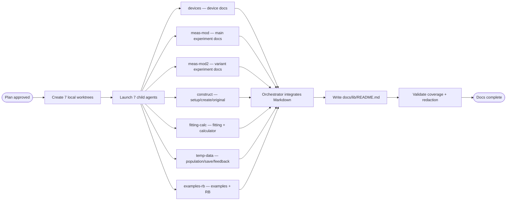

# Per-Module Documentation for `lib/`
Generate complete, per-module reference documentation for every Python module in `lib/`, covering every function/class with arguments, parameters, functionality, usage notes, and examples.
## Problem
The user wants standalone documents for every module in `lib/`, each explaining every single function with arguments, parameters, functionality, usage, and how-to examples. The repo currently has `MANUAL.md`, but it is a monolithic reference, has limited examples, and does not fully cover the device drivers, `utils/calculator.py`, the original `meas_helper.py`, or the example-notebook helpers.
## Scope
21 Python modules across three packages, excluding `__pycache__` and `.ipynb_checkpoints`.
* `lib/devices/`: `KeysightDMM34465A.py`, `KeysightWG33622A.py`, `SIM_wrapper.py`, `YokoGS200_wrapper.py`, `XLD_Server_Client.py`, `XLD_Server_Passkey.py`, `bftc_credentials.py`
* `lib/helpers/`: `setup_helper.py`, `meas_helper.py`, `meas_helper_mod.py`, `meas_helper_mod_2.py`, `create_meas_helper.py`, `fitting_helper.py`, `pop_temp_helper.py`, `pop_temp_helper_v2.py`, `save_data_helper.py`, `feedback_helper.py`, `randomized_benchmarking_helper.py`, `example_notebook_helper.py`, `example_notebook_simple.py`
* `lib/utils/`: `calculator.py`
## Output Structure
Docs will be written as Markdown under `docs/lib/`, mirroring the source layout.
* `docs/lib/README.md`: index linking to every module doc
* `docs/lib/devices/<module>.md`: one file per device module
* `docs/lib/helpers/<module>.md`: one file per helper module
* `docs/lib/utils/calculator.md`: utility module docs
## Per-Module Doc Template
Every module doc will use a consistent structure.
* Title: the module path, e.g. `lib/helpers/fitting_helper.py`
* One-line summary and a short paragraph on the module's role in the project
* Dependencies: notable imports and external libraries
* Contents: a bullet list of functions/classes
* One section per function, and per class/method, with signature, description, parameters, returns, usage notes, and a short realistic Python example
## Accuracy and Safety Rules
Docs are derived from the actual source. `MANUAL.md` can be used as a cross-reference, but examples must be written from the source signatures.
Known quirks will be documented rather than hidden, such as `save_data_helper.save_data` referencing an undefined variable and `meas_helper_mod.long_readout_qubit` being incomplete.
`bftc_credentials.py` contains a live API key and credential-like network details. `XLD_Server_Passkey.py` and `bftc_credentials.py` also contain IP addresses. Docs must describe variable names and purpose using placeholders such as `'<BFTS_API_KEY>'`, `'<fridge-ip>'`, and `'<port>'`; generated docs must not reproduce real secret or IP values.
## Orchestration
**Decision**: Use 7 parallel local child agents because the work is large, mostly independent, and cleanly separable by module group.
**Dependencies and ordering**: Research is complete. After plan approval, the orchestrator creates isolated worktrees, launches children, waits for their output, merges/cherry-picks generated Markdown files into the main checkout, writes the final `docs/lib/README.md` index, and validates completeness and redaction.
**Launch config**: All children share one batch using the plan-attached orchestration config. Local execution is proposed because the source files are local and children need filesystem access to read them. Each child uses a separate git worktree and branch to avoid collisions.
**Child agents**:
* **devices** — documents all 7 `lib/devices/` modules into `docs/lib/devices/*.md` from worktree `../sqt-docs-devices` on branch `docs/lib-devices`; must redact secret and IP values.
* **meas-mod** — documents `lib/helpers/meas_helper_mod.py` into `docs/lib/helpers/meas_helper_mod.md` from worktree `../sqt-docs-meas-mod` on branch `docs/lib-meas-mod`.
* **meas-mod2** — documents `lib/helpers/meas_helper_mod_2.py` into `docs/lib/helpers/meas_helper_mod_2.md` from worktree `../sqt-docs-meas-mod2` on branch `docs/lib-meas-mod2`.
* **construct** — documents `setup_helper.py`, `meas_helper.py`, and `create_meas_helper.py` into `docs/lib/helpers/*.md` from worktree `../sqt-docs-construct` on branch `docs/lib-construct`.
* **fitting-calc** — documents `fitting_helper.py` and `utils/calculator.py` into `docs/lib/helpers/fitting_helper.md` and `docs/lib/utils/calculator.md` from worktree `../sqt-docs-fitting-calc` on branch `docs/lib-fitting-calc`.
* **temp-data** — documents `pop_temp_helper.py`, `pop_temp_helper_v2.py`, `save_data_helper.py`, and `feedback_helper.py` into `docs/lib/helpers/*.md` from worktree `../sqt-docs-temp-data` on branch `docs/lib-temp-data`.
* **examples-rb** — documents `example_notebook_helper.py`, `example_notebook_simple.py`, and `randomized_benchmarking_helper.py` into `docs/lib/helpers/*.md` from worktree `../sqt-docs-examples-rb` on branch `docs/lib-examples-rb`.
Each child reports the files it created, the functions/classes it documented, and any quirks or incomplete functions it found.
**Merge strategy**: The orchestrator integrates generated docs into the current checkout by copying or cherry-picking only the disjoint `docs/lib/**` Markdown files from each worktree. The final result is one documentation set on the current branch; no commit is made unless requested.
**Diagram**:

## Validation
Confirm every one of the 21 modules has a corresponding `.md` file under `docs/lib/`.
Spot-check that each doc follows the template and includes signatures, parameters, returns, usage notes, and examples.
Search generated docs to confirm the live API key and internal IP values from credential modules do not appear.